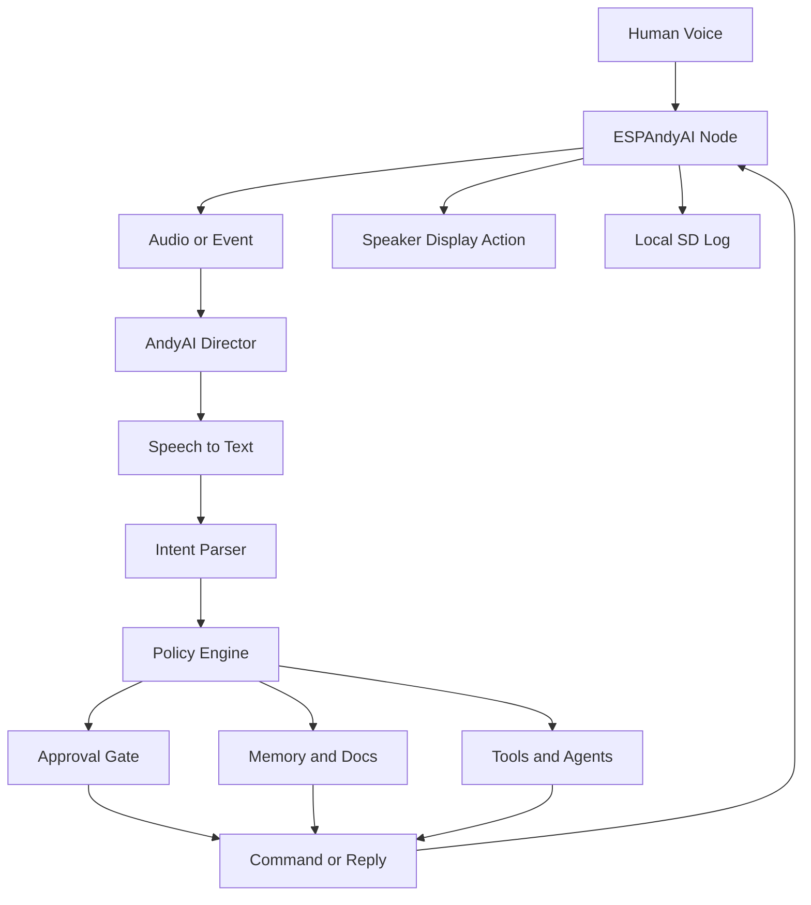
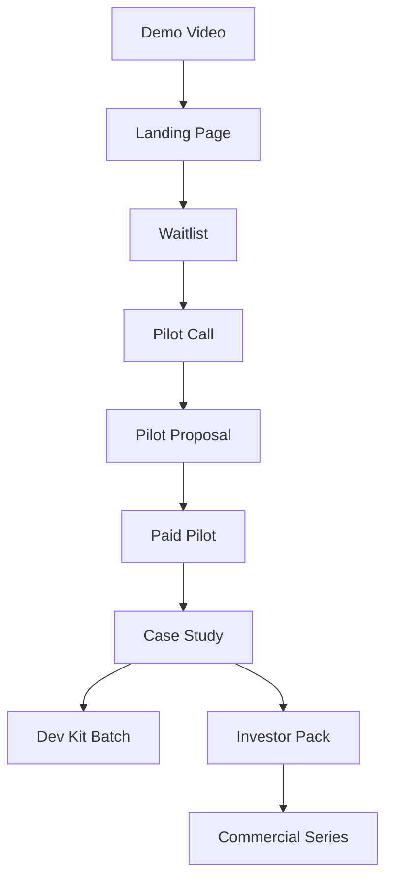
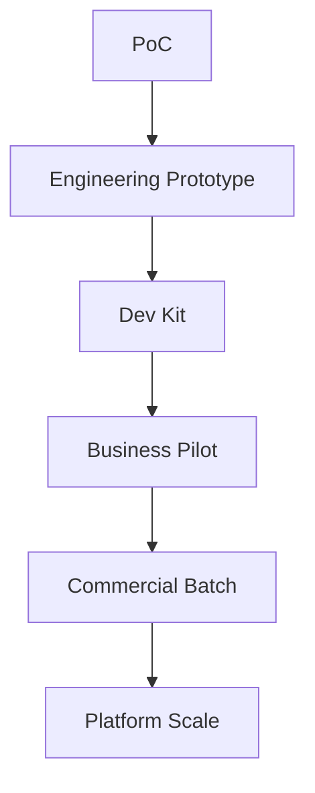

# Architecture Diagrams

## Mobile-Friendly Mermaid Diagram

```mermaid
flowchart TD
    A[Human Voice]
    B[ESPAndyAI Node]
    C[Audio or Event]
    D[AndyAI Director]
    E[Speech to Text]
    F[Intent Parser]
    G[Policy Engine]
    H[Memory and Docs]
    I[Tools and Agents]
    J[Approval Gate]
    K[Command or Reply]
    L[Speaker Display Action]
    M[Local SD Log]

    A --> B
    B --> C
    C --> D
    D --> E
    E --> F
    F --> G
    G --> H
    G --> I
    G --> J
    J --> K
    H --> K
    I --> K
    K --> B
    B --> L
    B --> M
```

## Business Flow Diagram

```mermaid
flowchart TD
    A[Demo Video]
    B[Landing Page]
    C[Waitlist]
    D[Pilot Call]
    E[Pilot Proposal]
    F[Paid Pilot]
    G[Case Study]
    H[Dev Kit Batch]
    I[Investor Pack]
    J[Commercial Series]

    A --> B
    B --> C
    C --> D
    D --> E
    E --> F
    F --> G
    G --> H
    G --> I
    I --> J
```

## Product Ladder

```mermaid
flowchart TD
    A[PoC]
    B[Engineering Prototype]
    C[Dev Kit]
    D[Business Pilot]
    E[Commercial Batch]
    F[Platform Scale]

    A --> B
    B --> C
    C --> D
    D --> E
    E --> F
```
