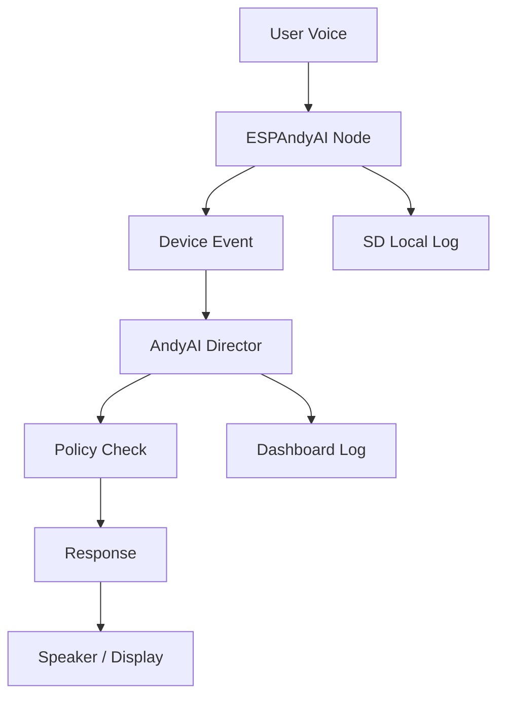
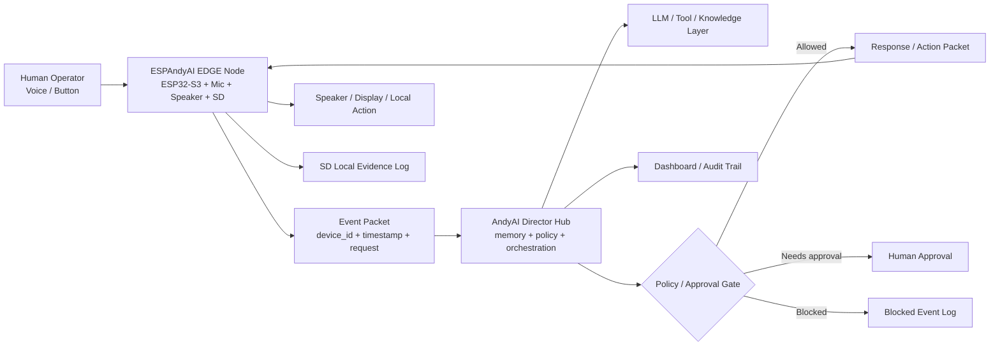

# Prototype Flow Diagrams v0.4

## Mobile-friendly Mermaid

```mermaid
flowchart TD
    A[User Voice] --> B[ESPAndyAI Node]
    B --> C[Device Event]
    C --> D[AndyAI Director]
    D --> E[Policy Check]
    E --> F[Response]
    F --> G[Speaker / Display]
    D --> H[Dashboard Log]
    B --> I[SD Local Log]
```

## Desktop Mermaid

```mermaid
flowchart LR
    U[Human Operator<br/>Voice / Button] --> N[ESPAndyAI EDGE Node<br/>ESP32-S3 + Mic + Speaker + SD]
    N --> P[Event Packet<br/>device_id + timestamp + request]
    P --> D[AndyAI Director Hub<br/>memory + policy + orchestration]
    D --> L[LLM / Tool / Knowledge Layer]
    D --> C{Policy / Approval Gate}
    C -->|Allowed| R[Response / Action Packet]
    C -->|Needs approval| H[Human Approval]
    C -->|Blocked| B[Blocked Event Log]
    R --> N
    N --> S[Speaker / Display / Local Action]
    N --> SD[SD Local Evidence Log]
    D --> DASH[Dashboard / Audit Trail]
```
